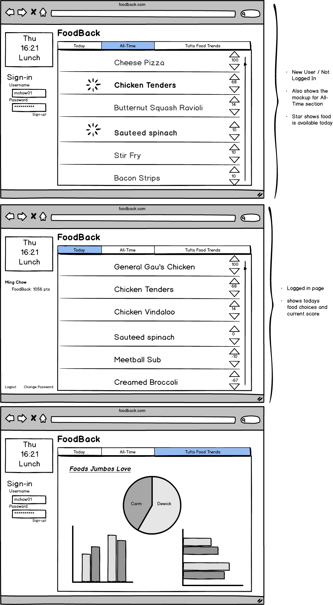

#BANAENAE

###Acknowledgements
* We would like to acknowledge Chris Sevilleja (@sevilayha) on scotch.io for his tutorial on authentication with Node.js

###The Problem
* Tuft's dining needs a better way to receive feedback and suggestions for their menu.

###The Solution
* A site that compiles Tuft's dining hall menus and lets students up and down vote items on the menu (similar to Yik-Yak's interface). The site will also provide a section for users to provide their own suggestions, which can then be up and down voted.

###Features:
* Server-side persistent data that is the storage of rankings from up and down votes.  ~~Also stores user's favorite foods based on foods they have upvoted multiple times.~~
* Front-end framework (Bootstrap)
* Graphs and charts showing most upvoted/favourited/served items
* Data scraping - obtaining daily menus from Tufts Dining site
* Geolocation - Site only available within Tufts Campus
* Main page refreshed daily that lists all items available for the day using up and down vote system
* All-time page that lists all-time popular daily items based on cumulative number of upvotes from daily section
* ~~User suggestions section featuring food item recommendations written by users using up and down vote system~~
* ~~Email/push notifications when your suggestions receive upvotes and when your favorite food will be offered~~

###Data
* Server-side persistent data that is the storage of rankings from up and down votes.  ~~Also stores user's favorite foods based on foods they have upvoted multiple times.~~

###Algorithms
* ~~We will formulate an algorithm that determines the time-frame that user suggestions will remain visible in their section~~

###Team Members:

* Ben Battle
* Tafari Duncan
* Param Chopra
* Jason Fan

###Wireframe:

#Comments by Ming
1. "Data scraping" --scrape what?  Be VERY careful --this will get ugly real fast
2. WAY too ambitious.  Lots of features.  You will be lucky to implement 2 or 3 or them well.
3. Overall score: 13 / 15
